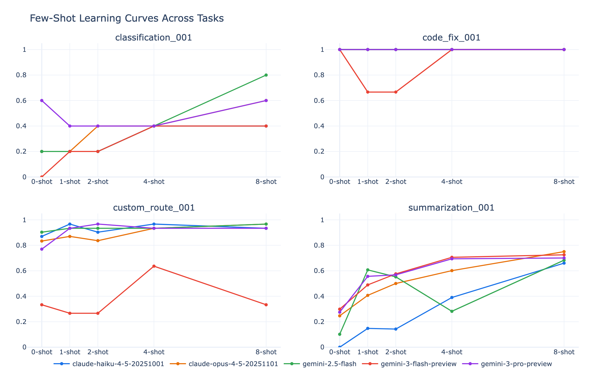
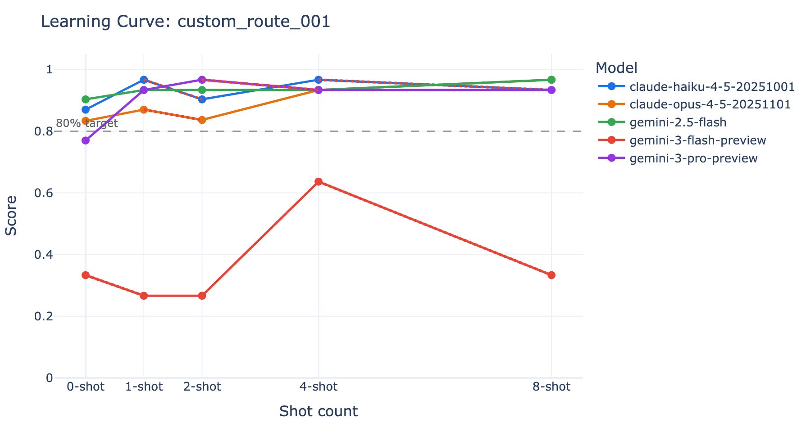

# adapt-gauge-core

[](https://opensource.org/licenses/MIT) [](https://www.python.org/downloads/) [](https://github.com/ShuntaroOkuma/adapt-gauge-core/actions/workflows/test.yml)

[English](README.md)

**LLMがfew-shot例からどれだけ速く学習するか測定し、性能崩壊を検出します。**

adapt-gauge-coreは、**適応効率（Adaptation Efficiency）** を測定するオープンソースの評価ハーネスです。言語モデルがfew-shot例（0, 1, 2, 4, 8 shot）でどれだけ速く改善するか、そして**ネガティブラーニング**（例を増やすと性能が低下する現象）が発生しないかを自動検出します。

## なぜ適応効率か？

標準的なLLMベンチマークは、単一のポイントでの精度を測定します。しかし実運用では、特定タスクに適応させるためにfew-shotプロンプティングが多用されます。その際、2つの重要な問題が生じます：

1. **このモデルには何個の例が必要か？** 2-shotでピーク性能に達するモデルもあれば、8-shot必要なモデルもあります。
2. **例を増やすと逆効果にならないか？** 一部のモデル・タスクの組み合わせでは、例を増やすと性能が*低下*します。これを**ネガティブラーニング**または**崩壊現象**と呼びます。

adapt-gauge-coreは両方の問いに自動で答えます。

### 実際の動作例

**4タスク × 5モデルのfew-shot学習曲線:**



**崩壊検出** — gemini-3-flash-previewが4-shotでピーク後、0-shotレベルまで急落:



## クイックスタート

### 前提条件

- Python 3.11+
- 少なくとも1つのモデルプロバイダーへのAPIアクセス：
  - **Google Cloud**（Vertex AI）: Geminiモデル用
  - **Anthropic**: Claudeモデル用
  - **LMStudio**: ローカルモデル用

### インストール

```bash
git clone https://github.com/ShuntaroOkuma/adapt-gauge-core.git
cd adapt-gauge-core
pip install -e ".[dev]"
```

### 設定

```bash
cp .env.example .env
# .env を編集してAPIキーを設定
```

### 評価の実行

```bash
# デフォルトモデル（Gemini 3 Flash, Claude Haiku 4.5）で実行
python -m adapt_gauge_core.runner --task-pack tasks/task_pack_core_demo.json

# モデルを指定して実行
python -m adapt_gauge_core.runner \
  --task-pack tasks/task_pack_core_demo.json \
  --models gemini-2.5-flash,claude-haiku-4-5-20251001

# 前回の実行を途中から再開
python -m adapt_gauge_core.runner \
  --task-pack tasks/task_pack_core_demo.json \
  --run-id 20260101_120000
```

### 結果の閲覧

デモ用の評価結果が同梱されているので、評価を実行しなくてもビューアを試せます：

```bash
# Streamlitビューア（viewerオプションが必要）
pip install -e ".[viewer]"

# デモ結果を閲覧（results/demo/ に同梱）
streamlit run src/adapt_gauge_core/viewer.py -- --results-dir results/demo

# 自分の評価結果を閲覧
streamlit run src/adapt_gauge_core/viewer.py
```

## 測定項目

各モデル・タスクの組み合わせについて、shot数（0, 1, 2, 4, 8）ごとに以下を測定します：

| メトリクス | 説明 |
|-----------|------|
| **改善率（Improvement Rate）** | shot追加あたりのスコア上昇量 |
| **閾値shot数（Threshold Shots）** | 目標スコア（デフォルト: 0.8）に到達する最小shot数 |
| **学習曲線AUC** | 学習曲線の面積（大きいほど学習が速い） |
| **ネガティブラーニング検出** | 8-shotスコアが0-shotから20%以上低下した場合に警告 |
| **pass@k** | 複数トライアルでの信頼性メトリクス |

## デモ用タスクパック

同梱の `task_pack_core_demo.json` には、異なる採点方式をカバーする4タスクが含まれています：

| タスク | 採点方式 | ドメイン |
|--------|---------|---------|
| 分類 | exact_match | メール分類 |
| コード修正 | contains | バグ修正 |
| 要約 | f1 | テキスト要約 |
| 配送ルート | llm_judge | ルート最適化 |

## プロジェクト構成

```
adapt-gauge-core/
├── src/adapt_gauge_core/
│   ├── runner.py              # CLIエントリポイント
│   ├── viewer.py              # Streamlit結果ビューア
│   ├── prompt_builder.py      # Few-shotプロンプト構築
│   ├── task_loader.py         # タスク/パックJSON読み込み
│   ├── efficiency_calc.py     # AUC、改善率、閾値計算
│   ├── harness_config.py      # 設定管理
│   ├── domain/                # エンティティと値オブジェクト
│   ├── scoring/               # 採点: exact_match, contains, f1, llm_judge
│   ├── infrastructure/        # モデルクライアント: Vertex AI, Claude, LMStudio
│   └── use_cases/             # AEI計算、ヘルスチェック
├── tasks/                     # タスク定義とデモパック
├── results/                   # 評価出力（CSV）
└── tests/                     # テストスイート（206+テスト）
```

## 採点方式

| 方式 | 説明 |
|------|------|
| `exact_match` | 正規化後の文字列完全一致 |
| `contains` | 期待出力が実際の出力に含まれるか |
| `f1` | トークンレベルのF1スコア（日本語トークン化対応） |
| `llm_judge` | graderモデルによるLLMベースの評価 |

## 設定

すべての設定は環境変数または `.env` ファイルで構成できます：

```bash
# トライアル
HARNESS_NUM_TRIALS=3           # 評価ごとのトライアル回数
HARNESS_AGGREGATION=mean       # mean または median

# LLM Judge
LLM_JUDGE_ENABLED=true
LLM_JUDGE_GRADER_MODEL=gemini-2.5-flash

# 信頼性
HARNESS_PASS_AT_K=true
HARNESS_K_VALUES=1,3
```

全設定は [.env.example](.env.example) を参照してください。

## テストの実行

```bash
make test
# または
python -m pytest tests/ -v
```

## ライセンス

MIT
